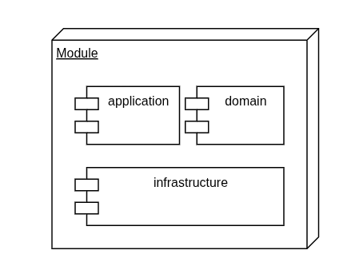
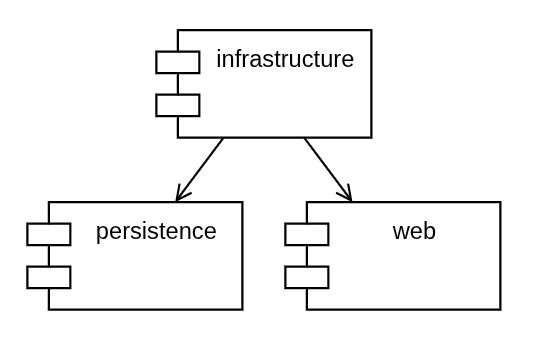
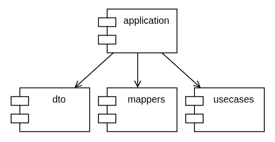
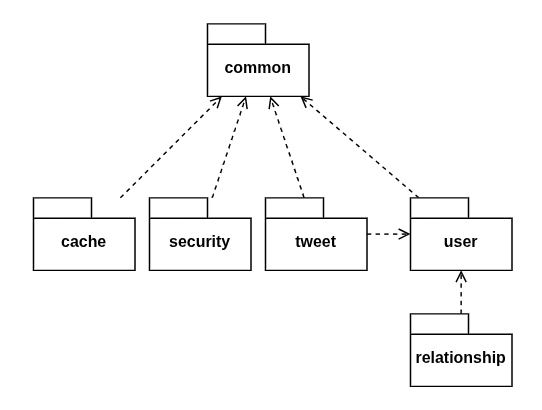
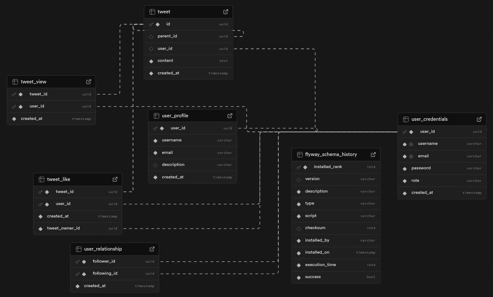

<br>
<br>

<div align="center">


<h3 align="center">Twitter API v2</h3>    

<p>

API para gerenciar um mini twitter

**[Documentação »](https://twitterapi.up.railway.app/swagger-ui.html)**

</p>

</div>

> ⚙️ Em contrução 

## Sobre

Projeto desenvolvido seguindo princípios de **Domain Driven Design** e **Clean Architecture**.

## Tecnologias

- Java 17
  - JavaDoc
- Spring Framework
    - SpringBoot
    - Spring Security
    - Spring OpenAPI (Swagger)
    - Spring Modulith
- Lombok
- JWT
- JUnit
- Mockito
- SQL
- Flyway
- PostgreSQL / H2 Database / Redis
- Docker/Docker compose

## Features

- [x] Autenticação
- [x] Seguir usuários
- [x] Criar tweet
- [x] Interagir com tweet (comentário/like/view)
- [x] Buscar usuários
- [x] Listar tweets
- [ ] Feed personalizado por usuário

## Como rodar localmente
1. Clone o projeto

    ````bash
    git clone https://github.com/filipemartinsdev/twitter-api
    cd twitter-api
    ````

2. Crie e configure o arquivo `.env`

    ````
    cp .env.example .env
    ````

    ````dotenv
    JWT_SECRET=<YOUR_SECRET>
    JWT_ISSUER=<YOUR_ISSUER>
    
    DB_URL=<YOUR_URL>
    DB_USERNAME=<YOUR_USERNAME>
    DB_PASSWORD=<YOUR_PASSWORD>
    ````

3. Inicie os containers

    ````bash
    docker compose -f docker-compose-dev.yaml up -d --build
    ````

## Requisitos funcionais
- Cadastro, Login e gerenciamento de usuários
- Criação e gerenciamento de posts (tweets)
- Interação entre usuário e tweet (like, comentário e visualização)
- Interação entre usuários (follow/unfollow)
- Busca de usuários
- Busca de tweets

## Requisitos não funcionais
- Tempo de resposta máximo de 1s (1000ms)
- Cache de pesquisas
- Response padronizado (JSend)
- Criptografia de senhas
- Autenticação com JWT
- Comportamento Stateless

## Arquitetura & Design
Projeto monolítico, seguindo princípios de:
- SOLID
- Domain Driven Design
- Clean Architecture

### Módulos
Os módulos seguem uma estrutura clara:



Cada módulo possui três componentes padrões - application, domain e infrastructure.





Seguindo esse padrão, têm-se os seguintes módulos:



### Database

A modelagem foi feito em um banco relacional.



## To do list

- [x] Autenticação
  - [x] Login/Register
  - [x] Token JWT
  - [x] User roles
- [x] Database Migrations
- [ ] Testes unitários (em progresso)
- [ ] Documentação (em progresso)
  - [ ] API 
  - [ ] Projeto
- [x] Cache (Redis)
- [x] Imagem Docker
- [x] Container configs (Docker compose)
- [x] Deploy (Railway)

---

_Made with ❤️ and ☕ by **Filipe Martins**_
